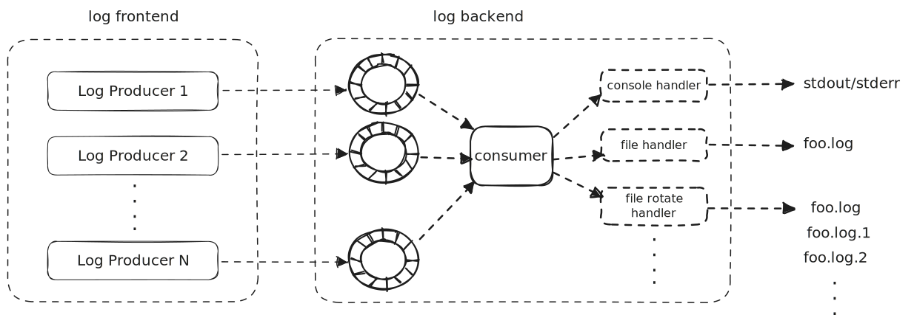

## haclog


* [readme EN](./README.md)
* [readme 中文](./README_cn.md)

## 概述

haclog(**H**appy **A**sync **C** Log) 是一个纯 C 的异步日志库, 该库的主要目标是使 **日志前端(日志生产者线程)** 的写入耗时尽可能的少  



## 编译
`haclog` 支持多种构建工具

### cmake
```
mkdir build
cd build
cmake ..
```

若除编译日志库本身, 还想运行单元测试和基准测试, 可直接运行 `run_test_and_benchmark.sh` (Windows 下运行 `run_test_and_benchmark.bat`)

### meson
```
meson setup build
meson compile -C build
```

## 使用示例
### hello
```
#include <stdlib.h>
#include "haclog/haclog.h"

void add_console_handler()
{
	static haclog_console_handler_t handler;
	memset(&handler, 0, sizeof(handler));
	if (haclog_console_handler_init(&handler, 1) != 0) {
		fprintf(stderr, "failed init console handler");
		exit(EXIT_FAILURE);
	}

	haclog_handler_set_level((haclog_handler_t *)&handler, HACLOG_LEVEL_INFO);
	haclog_context_add_handler((haclog_handler_t *)&handler);
}

int main()
{
	// add console handler
	add_console_handler();

	// run haclog backend
	haclog_backend_run();

	// initialize thread context
	haclog_thread_context_init();

	HACLOG_INFO("Hello World");

	double pi = 3.14159265359;
	HACLOG_DEBUG("π = %.5f", pi);

	// NOTE: assert false will crash when build type is debug
	int actual = 0;
	int expect = 1;
	HACLOG_ASSERT_MSG(actual == expect,
		"actual: %d, expect: %d", actual, expect);

	// NOTE: fatal level log will crash when build type is debug
	HACLOG_FATAL("fatal message! crash when debug");

	// cleanup thread context
	haclog_thread_context_init();

	return 0;
}
```

* 通过 `haclog_context_add_handler`, 可以添加不同的日志处理器, 当前内置了以下的 `handler`
  * `haclog_console_handler_t`: 输出到终端
  * `haclog_file_handler_t`: 输出到文件
  * `haclog_file_rotate_handler_t`: 输出到文件, 并根据文件大小进行旋转
  * `haclog_file_time_rot_handler_t`: 输出到文件, 并根据时间进行旋转
* 当添加完需要使用的 `handler` 之后, 调用 `haclog_backend_run` 运行日志后端
* 在每个线程当中, 在写日志之前，需要调用 `haclog_thread_context_init` 初始化 `haclog` 线程上下文
* 在每个线程退出时, 调用 `haclog_thread_context_init` 进行 `haclog` 的清理工作

**特别注意**: `haclog` 每条日志当中的格式化字符串必须为**字面常量(string literal)**, 当使用 C++ 调用 `haclog` 时, 编译器将帮助用户进行自动检测; 而当使用 C 时, 用户需要自己来保证这点  
```
/* 太糟了!!! 别这么做, format 字符串需要为字面常量 */
// char *fmt_str = NULL;
// int v = rand();
// if (v % 2 == 0) {
// 	fmt_str = "%d is even";
// } else {
// 	fmt_str = "%d is odd";
// }
// HACLOG_FATAL(fmt_str, v);
```

### file handler
```
void add_file_handler()
{
	static haclog_file_handler_t handler;
	memset(&handler, 0, sizeof(handler));
	if (haclog_file_handler_init(&handler, "logs/hello.log", "w") != 0) {
		fprintf(stderr, "failed init file handler");
		exit(EXIT_FAILURE);
	}
	haclog_handler_set_level((haclog_handler_t *)&handler, HACLOG_LEVEL_DEBUG);
	haclog_context_add_handler((haclog_handler_t *)&handler);
}
```

### rotate file handler
```
void add_file_rotate_handler()
{
	static haclog_file_rotate_handler_t handler;
	memset(&handler, 0, sizeof(handler));
	if (haclog_file_rotate_handler_init(&handler, "logs/hello.rot.log", 128 * 1024 * 1024, 5) != 0) {
		fprintf(stderr, "failed init file handler");
		exit(EXIT_FAILURE);
	}
	haclog_handler_set_level((haclog_handler_t *)&handler, HACLOG_LEVEL_DEBUG);
	haclog_context_add_handler((haclog_handler_t *)&handler);
}
```

### time rotate file handler
```
void add_file_time_rot_handler()
{
	static haclog_file_time_rot_handler_t handler;
	memset(&handler, 0, sizeof(handler));
	if (haclog_file_time_rotate_handler_init( &handler, "logs/hello.time_rot.log", HACLOG_TIME_ROTATE_UNIT_DAY, 2, 0) != 0) {
		fprintf(stderr, "failed init file time rotate handler");
		exit(EXIT_FAILURE);
	}
	haclog_handler_set_level((haclog_handler_t *)&handler, HACLOG_LEVEL_DEBUG);
	haclog_context_add_handler((haclog_handler_t *)&handler);
}
```

### 自定义日志格式
默认情况下, 会打印详细的日志信息, 格式如下:  
`${日志等级}|${UTC+0的日期时间}|${日志所在文件和行号}|${日志所在的函数}|${线程号}`  

用户也可以自定义 `handler` 的日志信息格式化函数
```
int my_write_meta(struct haclog_handler *handler, haclog_meta_info_t *meta)
{
	const char *level = haclog_level_to_str(meta->loc->level);
	return handler->writev(handler, "%s|%llu.%lu ", level,
						   (unsigned long long)meta->ts.tv_sec,
						   (unsigned long)meta->ts.tv_nsec);
}

...

haclog_handler_set_fn_write_meta((haclog_handler_t *)&handler, my_write_meta);
haclog_context_add_handler((haclog_handler_t *)&handler);
```

### 设置线程 Bytes Buffer 大小
```
haclog_context_set_bytes_buf_size(2 * 1024 * 1024);
```

### 设置日志一行的最大长度
```
haclog_context_set_msg_buf_size(2048);
```
